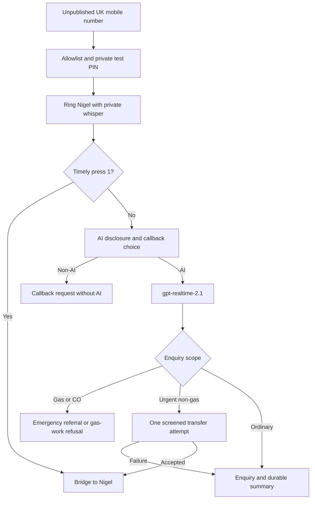

# Step 4.5 hardening and Step 5 private-pilot preparation

4 October 2026. Prepared on `feature/ai-receptionist-v1` from reviewed commit
`6d457fcd54d6348141d6d1b1de9ffc99ddacb24f`. No paid APIs, number purchase,
account provisioning, deployment, production data access or telephony connection.
The existing public photography/hairdressing number is unchanged.

## Evidence and model decision

The completed synthetic `benchmark-report.json` has SHA-256
`4d056b2cdfde2f6043c61c87dd91859c05b130f1931296590d9cbf83712e239f`.
It contains 27 scored trials, plus the reconciled, unscored first mini normal
trial. Existing paid evidence and the Mac spending journal are not modified.
The report's loaded planning spend is £1.0482437500, with no unresolved usage.
This is the existing benchmark's conservative conversion, not a sterling invoice.

| Measure | Larger: gpt-realtime-2.1 | Mini |
| --- | --- | --- |
| Completed scored trials | 14 | 13 |
| Exact extraction | 52/58 (89.7%) | 39/53 (73.6%) |
| Provided phone number | 9/9 | 7/8 |
| Provided postcode | 8/9 | 2/8 |
| Median transport latency | 2.051 seconds | 1.823 seconds |
| Spoken responses truncated at 768 tokens | 4 | 6 |

For the 13 scenarios with both models scored, larger exact extraction is 48/53
versus 39/53; postcode accuracy is 7/8 versus 2/8. This supports Nigel's chosen
**gpt-realtime-2.1** pilot candidate. The modest latency difference does not
outweigh the extraction gap. Neither this sample nor keyword screens establish
live-phone safety, human accent reliability or naturalness. Human listening
review is still pending in the original report; no new model result is invented.

Specific findings used: repeated introductions/full-detail recaps; long spoken
turns; lost/partial names under interruption; incomplete `GU1`; misheard `G4`
and `DE2`; a corrected final phone suffix; repeated/invented family context in
mini; unsafe mini CO electricity-isolation and gas stop-tap instructions.
`G4 7LL` is syntactically valid: it must be confirmed when uncertain, never
automatically rewritten to `GU4 7LL` because Guildford was mentioned.

## Changes and revised behaviour

The completed Step 4 lab, cases, prices, caps, prompts, reports and audio are
frozen. The candidate pilot prompt is separate in `business/voice_prompts.py`.
The application voice feature remains disabled by default.

| Change | Behaviour |
| --- | --- |
| New candidate prompt | Usually 10–25 words, ordinary ceiling 40; essential emergency ceiling 65. One short question, then listen. Introduce as AI once. |
| Contact helpers | Check complete postcode syntax and existing UK phone normalisation; ask about only the uncertain contact; explicit annotated corrections replace only the stated suffix. Never infer missing letters/digits. |
| Safety/service gate | Separate ordinary plumbing, gas emergency referral, gas work not offered and ambiguous appliance clarification. Conservative caller-text matching supplements extracted facts. Unknown-fuel boiler requests cannot become plumbing jobs/transfers. |
| App intake | Gas/CO and gas-service requests create call/audit/notification records, not new routine leads. No gas transfer or attendance request. False confirmed-appointment snapshots are rejected transactionally. |
| Existing lead protection | If gas is discovered after a genuine non-gas enquiry, retain the earlier lead unchanged; do not write the gas work into it or create a gas job. Call/notification scope records the safety/refusal route. |
| Version metadata | New scripted snapshots use offline-policy-v2; old v1 remains readable. Historical lab evidence is unchanged. |
| Pilot specification | Inactive pure state machine and TwiML renderers; no SDK, network handler or provider activation. Timely/correlated DTMF 1, verified bridge, one urgent attempt, stale/duplicate handling and opt-out. |

The gate is a text rule set, not a complete natural-language or audio safety
classifier. It cannot prove that a future model recognises every gas euphemism
or accent. Pilot launch must include a caller-transcript/action gate and reviewed
spoken-output handling; raw model assertions cannot authorise calls or bookings.
Word limits are prompt goals and template checks, not a mathematical guarantee
of generated speech/token usage. Keep the 768 cap; handle incomplete responses
without automatic paid retries and without saying advice/booking was delivered.

Verification: **194 offline tests passed**, including **81 voice tests** (44
foundation/intake, the existing 21 Step 4 tests, and 16 hardening/routing tests).
There are 21 new regression tests overall. Existing FastAPI startup deprecation
warnings remain, not test failures. All app tests use disposable synthetic
storage and block outbound I/O; pilot renderers make no provider calls. The
report hash above remains unchanged. No Mac ledger/evidence was accessed for
mutation. Published cost arithmetic and emergency template word counts were
checked locally (51 gas/CO, 40 electrical, 34 water, including brief AI identity).

Candidate examples (offline policy wording, not new model measurements):

- Clear ordinary enquiry: “Thanks, I've noted the tap repair. What day would suit you?”
- Unclear postcode: “Could you give the full postcode, letters and digits separately?”
- Unclear callback: “Could you give the full callback number, slowly?”
- Returning caller: “I can't see previous job details. What needs doing this time?”
- Appointment request: “I've noted Tuesday afternoon as a preference. Nigel will need to confirm availability.”
- Urgent non-gas water: give conditional stop-tap safety, then “Would you like me to try Nigel once?”
- Transfer failure: “I couldn't reach Nigel. I'll flag your enquiry as urgent; attendance isn't guaranteed.” Only say it was saved after durable acknowledgement.

Gas/CO fixed message:

> Leave the affected area for fresh air now. If anyone is seriously unwell or in immediate danger, call 999. From a safe place, call the National Gas Emergency Service on 0800 111 999. Avoid flames and electrical switches. Do not go back inside or wait for Nigel.

Gas repair/service refusal:

> Nigel Harvey Plumbing does not currently undertake gas work. Please contact a Gas Safe registered engineer for gas repairs, servicing or installation.

Never suggest Nigel can diagnose, repair, service, install or attend gas
appliances/pipework. No gas quote, booking, promise of attendance, Nigel transfer
or claim of Gas Safe registration. No gas/electrical isolation instructions in
gas/CO conversations. Basic emergency referral takes priority over data capture.
For water/electrics only: stay away, never touch switches while standing in water;
isolate only from a safely accessible dry point away from danger; otherwise leave
it alone. Immediate danger: 999. For uncontrolled water only: known, safely
reachable water stop tap; avoid damaged ceilings; no diagnosis or repair advice.

## Exact proposed call architecture

Nigel owns the Twilio account/number entitlement and controls routing. The AI
provider is behind an adapter: changing it does not change the phone number.
Portability to another telephone provider depends on the specific range and
receiving provider; verify voice/SMS portability before purchasing. No eSIM is
needed for the programmable number. Keep the current public number untouched.

1. Signature-valid inbound call to the purchased pilot `To`, owned Account SID,
   allowlisted normalised `From` and tester PIN. Caller ID alone is spoofable;
   do not admit just because it matches the allowlist. Reject unknown callers
   before opening an AI session or making an outbound leg. Keep PINs out of logs.
2. `<Dial answerOnBridge="true" timeout="15" record="do-not-record">` to
   exactly Nigel's configured mobile, showing the new plumbing number as caller ID.
   `<Number url=".../screen">` executes the whisper on Nigel's leg only:
   “Plumbing call — press 1 to accept.” DTMF-only Gather, one digit, five seconds,
   action on empty result; anything except valid 1 hangs up that child leg.
3. Twilio adds approximately five seconds to Dial timeout. Nominal ringing is
   therefore about 20 seconds, not a promise of exact iPhone timing. A durable
   controller deadline at 20 seconds from dial start must cancel an unaccepted
   child and redirect the parent; whisper must not extend the wait indefinitely.
   Reject late digits atomically. The deadline/watchdog is specified, not started.
4. Answered child/`DialCallStatus=completed` does NOT prove human acceptance.
   Only the correlated DTMF acceptance authorises a bridge; verified bridge state
   confirms it. Busy/reject/no answer/voicemail/whisper timeout use AI fallback.
   End an accepted human call on disconnect; do not replay AI after a completed
   conversation. Tests must prove actual provider behaviour, including voicemail.
5. Before streaming: disclosure and DTMF 0 for a non-AI callback. No AI session
   or transcript for the opt-out path. Store a valid presented number only with
   callback agreement, or collect/confirm callback digits through DTMF if withheld.
   No recording/voicemail capture on this route. No promised callback time.
6. `<Connect><Stream>` to the owned staging `wss://.../pilot/media`, opaque bound
   context via `<Parameter>`, no query string. Twilio μ-law/8kHz is converted to
   the chosen Realtime codec (or use a mutually supported codec after validation).
   Bidirectional media only; no ConversationRelay, conference, AMD or paid Twilio
   transcription. Realtime model, reasoning low, Marin, manual response creation,
   VAD cancellation, output cap 768; no quote/calendar/history/booking tools.
7. Build the caller-text/service gate before action tools. For first pilot,
   buffer each assistant turn until its transcript is screened before playback;
   use fixed safety/refusal messages when a gas event is detected. This may
   increase latency and needs measurement. Input transcription or a bounded
   pre-response capture/classification step must be selected and priced before
   implementation; ordinary generation alone cannot give an independent input
   safety gate. No additional model/ASR endpoint is selected or enabled here.
8. On talk-over: cancel generation, Twilio `clear` queued audio, reconcile `mark`
   acknowledgements, and truncate model context at the actually heard offset.
   A mark returned because of clear must not be counted as played audio. Do not
   treat a truncated emergency instruction as delivered; replay the critical
   fixed advice if needed. Duplicate events cannot cause extra paid responses.
9. Urgent non-gas scope + caller permission: persist `urgent_attempts=1` BEFORE
   dial, suspend the AI, close/update the parent stream safely, then one screened
   Dial using an urgent whisper. No simultaneous AI audio and human bridge. A
   failure returns to capture/urgent review, with no further transfer. Gas/CO
   detection invalidates any pending urgent acceptance and cancels that leg.
10. AI/socket/provider failure, output truncation, unknown usage, invalid signature
    or budget exhaustion stops further generation. Use a short static failure
    and callback option when safely possible; gas safety never waits for Nigel.
    Save partial allowed facts/call outcome plus durable notification when storage
    is available. On storage failure, never claim the enquiry was saved. Terminal
    callbacks/caller hangup cancel every child and the model session.

All outbound targets are server configured. Caller/LLM cannot supply a phone
destination, dial premium/international numbers or place a new general call.
One concurrent tester, parent-call wall limit 300 seconds, maximum 12 paid AI
responses per call, bounded silence/session timers. Reserve all possibly billed
legs/minute rounding and each model response before beginning it; settle actual
provider usage, stop on unresolved usage, no automatic retries or reload loops.

## Account, number and KYC handover

Recommended number: **UK +447 mobile with BOTH voice and two-way SMS**, verified
in the inventory before purchase. Local 01483 would look more local but is not
the preferred same-number two-way SMS option. SMS stays disabled in this pilot.
Do not use 070 personal/premium ranges or assume every +447 range has the same
mobile termination tariff.

Nigel/company owns the login, MFA, billing method and keys. Register as a direct
business customer (not an ISV selling phone numbers). UK mobile business bundle:
legal company name, registration authority `UK:CRN`, Companies House number,
website, valid business address, authorised senior representative name, work
email and a reachable genuine mobile (not a CPaaS number). Official published
business requirements currently say no supporting documentation required;
verification may still request evidence. Do not invent registration/VAT details
or claim that approval is guaranteed. Individual registration differs and may
require government ID; the Ltd business route is proposed. KYC addresses stay
private account information, not a public service-area address listing.

Before provisioning: verify email/phone, enable MFA, confirm legal details and
approved mobile regulatory bundle; review number capabilities, recurring rental,
destination tariff, initial funding amount/tax, and disable auto recharge.
Any free account/KYC onboarding or terms acceptance needs a separately authorised
setup step; none was done here. UK outbound geography only, exact destination
allowlist, spend alerts, no support upgrade, subscription, reserved number or SMS.

## Prices and fully specified estimates

Checked official public prices on 4 October 2026. USD pay-as-you-go before tax,
FX/card fees and any carrier/destination surcharges; recheck at checkout.

| Component | Published unit price |
| --- | --- |
| UK mobile number rental | $2.50/month |
| UK inbound mobile call | $0.0100/billed minute |
| Standard UK mobile outbound leg | $0.0305/billed minute; Mobile Other is $0.3200, so verify Nigel's exact destination tariff |
| Bidirectional Media Streams | $0.0044/billed minute |
| Separate Render Starter staging service | $7/month |
| Proposed 1GB durable pilot disk | $0.25/month |
| Realtime 2.1 text tokens | $4 input / $0.40 cached input / $24 output per million |
| Realtime 2.1 audio tokens | $32 input / $0.40 cached input / $64 output per million |
| Optional later UK SMS | $0.056 outbound and $0.0075 inbound per segment, plus applicable fees; disabled |

Exact fixed proposed monthly subtotal: **$9.75** (number + one isolated service
+ 1GB disk). A published separate setup/activation fee was not found; this is
not a promise that checkout funding is zero. Initial Twilio prepayment is credit,
not an extra monthly service fee; its required amount is not reliably available
from the public upgrade page and must be shown to Nigel before funding. Do not
assume $20 or promise an exact sterling debit. New OpenAI credit purchases are
also separate, unapproved, and unnecessary if the existing approved account is
already funded. No credit/trial allowance is assumed in the estimates.

Variable formula in USD:

`9.75 + 0.0100 × inbound billed minutes + 0.0305 × standard-mobile billed minutes + 0.0044 × stream billed minutes + actual OpenAI token charges`

Twilio rounds partial minutes per product/leg up. A voicemail that answers a
short whisper can create a full outbound billed minute even when never bridged.
Screening and transfer legs must be counted; do not price only AI minutes.
AI history is resent across turns, so there is no exact universal per-minute
OpenAI cost. Use **$0.20 per elapsed AI minute as a provisional planning allowance**,
including room for text/capture/possible input classification. It is not a
provider tariff or hard cap; the chosen input gate, longer context and extra
turns can exceed it. Bound/reserve actual token usage and stop rather than treating
this allowance as guaranteed. Fixed-message gas/opt-out flows may cost less.

Private pilot example: at most 20 tester calls, 30 elapsed AI minutes, allowance
of 100 inbound billed minutes, 40 stream billed minutes and 35 standard-mobile
billed minutes (screening plus urgent tests):

| Item | USD |
| --- | --- |
| Monthly fixed costs | 9.7500 |
| Inbound | 1.0000 |
| Streams | 0.1760 |
| Mobile legs | 1.0675 |
| Provisional OpenAI allowance | 6.0000 |
| First-month operating estimate | **17.9935** |

Planning at **£1.25 per USD** (the existing conservative loaded assumption,
not today's FX quote): **£22.49**. A future £30 operating ceiling is proposed,
not authorised. Funding deposits can make initial cash outlay higher than the
operating estimate and require explicit separate approval of the actual amount.

Monthly examples below assume only AI-fallback enquiries: 2 elapsed AI minutes
per call, 3 billed inbound minutes, 2 stream minutes and 1 answered screening
minute per call, no urgent/human connected time, standard mobile rate and the
$0.20 AI planning allowance. Actual human calls/transfers are extra under the
formula. Fixed costs included; no SMS, recording, provider transcription or new
ASR-specific tariff beyond the provisional allowance. These are calculations,
not a provider quote.

| Elapsed AI minutes | USD/month | Loaded GBP planning |
| --- | --- | --- |
| 50 | 21.4825 | £26.85 |
| 100 | 33.2150 | £41.52 |
| 250 | 68.4125 | £85.52 |
| 500 | 127.0750 | £158.84 |

## Secrets, webhook security and staging integration

`docs/ai-receptionist-pilot.env.example` lists empty placeholders and disabled
flags, not keys. Future secrets enter owner-managed secret settings only. No
key in source, URLs, browser bundles, screenshots, reports, logs or Git.

| Values | Purpose |
| --- | --- |
| TWILIO_ACCOUNT_SID, AUTH_TOKEN | Owned account match and official Twilio signature validation; do not confuse API secret with webhook Auth Token |
| TWILIO_API_KEY_SID, API_KEY_SECRET | Restricted server REST credentials; least privilege and rotation |
| OPENAI_API_KEY | Dedicated plumbing project, server-only, chosen model and approved usage controls |
| New number, Nigel mobile, tester allowlist/PIN hashes | Configured destinations/admission, not model tools; existing public number unchanged |
| Fixed staging HTTPS origin, sandbox root/DB, encryption/HMAC keys | Signature URL reconstruction and isolated app intake; no production secrets/data |
| Pilot flags, limits and persistent journal path | Disabled defaults and separately approved future budget; old benchmark journal never reset |

Validate every form/JSON webhook and WebSocket upgrade using Twilio's official
RequestValidator and the exact external URL/parameters/body, including signed
query strings/bodySHA256 where applicable. Reconstruct the canonical URL from
trusted deployment configuration, not arbitrary forwarded Host headers. Require
TLS/WSS and validate Account SID, To, direction, root/child Call SID relationships,
Stream SID and one-use bound contexts. Twilio signatures alone are not replay
protection: durable idempotent transitions, duplicate status detection and
timely acceptance are required. Bound request/PCM sizes, rate-limit and reject
before provider I/O. Do not rely on IP allowlisting instead of signatures.

Reuse existing root-call/enquiry transaction, telephone normalisation, customer
match safeguards, encrypted transcript storage and leased notification outbox in
a NEW isolated staging copy, populated with fictional customers only. No copied
production DB, environment file, invoice, quote or media. One proposed paid
always-on service hosts the adapter and sandbox app; its own durable disk stores
pilot state, call journal and outbox. Staff-only access, noindex, no public links,
no site SEO/template changes. No deployment or service creation performed.

The existing v1 intake remains **simulation-only, development/test only**.
Do not falsely label real Twilio events as simulation to bypass its protections.
A separate validated pilot provider contract/controller and explicit owned-staging
environment gate must be implemented under the next authorised build stage,
before activation. Persist state/attempt count/deadline/reservation atomically;
use the parent Call SID as root across all legs. Reconcile failed/crashed sessions
before any new dial or response. One root produces at most one permitted lead;
do not create a new customer merely because a phone number matches. Caller ID
is not identity and no history is disclosed. No automatic quotes/jobs/bookings.

Notification sending is still injected/offline; select owner-only authenticated
in-app review for the first pilot or separately approve an email sender. No SMS,
WhatsApp or messages to callers. Failures are durable/retry bounded; summaries
do not include full transcripts/health details and use the scoped no-attendance
flag for gas referrals. Scheduled expiry/outbox execution must be wired and
proved on staging before data is stored there; do not claim it runs already.

## Privacy gates before testers and before customers

Real tester numbers/voices are personal data even when the enquiry is fictional.
Give testers the draft notice and agreement before access. For first pilot no
saved call audio; Twilio record is off, PCM in memory only. No raw debugging
audio or unrestricted transcript exports. Do not reuse the historical synthetic
benchmark's paid-evidence export for live/tester calls.

Proposed disclosure before any AI processing:

> Hello, I'm the AI receptionist for Nigel Harvey Plumbing. I'll transcribe our conversation to take your enquiry. Press 0 for a non-AI callback.

Provide a short written tester privacy sheet and a future layered privacy notice
with controller/contact, enquiry purpose, lawful basis, providers/subprocessors,
transfers, storage periods, rights/ICO complaint route and alternative. Continuing
after notice is not blanket GDPR consent. Assess Article 6 contract steps or
legitimate interests by purpose; complete the LIA if relying on legitimate
interests. The non-AI callback path must work before streaming; no hidden AI
processing of a caller who opted out. Phone conversations directly with Nigel
are not recorded/transcribed by this proposed AI system.

Retention proposal: no audio; encrypted transcripts 30 days maximum; call content
90 days; notification payload 7 days. Existing foundation has those expiry
structures and deletion controls. For private testers, purge personal call
content sooner after review if not needed. Summary/lead retention needs a
separate enquiry/job policy and periodic deletion; 90-day call redaction does
not automatically delete the linked lead. Durable minimal replay/billing
tombstones must not retain caller text indefinitely. Backups, provider logs and
restores need their own time bounds and deletion/tombstone reapplication tests.

OpenAI currently documents Realtime data as not used for training by default,
30-day abuse-monitoring retention and no application-state retention. Do not
claim zero retention or UK-only processing. Realtime regional processing support
is documented for US/Europe, not automatically the UK storage endpoint; Europe
eligibility and model/voice support need provider confirmation. Review both
providers' DPAs, subprocessors and international transfer safeguards/assessment.
Provider-side logs may outlive local deletion and must be described accurately.

Complete a DPIA (AI/audio, emergency safety and potentially vulnerable callers),
document the LIA/lawful-basis choice, data flow, necessity, security and residual
risks. Avoid asking/storing medical details; suspected CO illness may nevertheless
reveal health information, so review Article 9 handling/redaction before retaining
real transcripts. Store only a minimal safety referral summary where appropriate.
No diagnoses, profiling, voice biometrics or solely automated consequential
decisions. Human reviews enquiries; opt-out must not impair access to service.
Confirm ICO fee/registration position for the existing Ltd company; no payment
or claim that its existing registration is verified. Nothing here certifies
compliance or publishes a privacy policy.

## Private test matrix and release/rollback gates

All telephone tests below remain **not run**. They require separate activation
and spending approval. Use only allowlisted consenting testers with fictional
enquiries; do not publish the number or change the existing public number.

| Test | Required result/evidence |
| --- | --- |
| iPhone answers and presses 1 | Private whisper only to Nigel; verified bridge; no AI session or transcript |
| Answers but no digit/wrong digit | Child ends; caller AI/opt-out fallback; no bridge |
| Personal voicemail/Live Voicemail | Never authorises bridge; no caller conversation in personal voicemail; may contain only whisper; fallback |
| Reject/busy | Prompt fallback, no repeated initial dial |
| DND, silenced unknown callers, Focus | Timely fallback whether silenced or forwarded to voicemail; document the tested iPhone setting |
| Call waiting, second SIM if used | Existing conversation unaffected; no accept means fallback; decline/no additional dial loops |
| Ring timing/late press 1 | Measure caller-to-ring and total-to-AI; late acceptance cannot race fallback |
| Caller ID/withheld/spoof attempts | Nigel sees dedicated plumbing number; allowlist plus PIN admission; withheld callback path; no invented caller identity |
| Normal/partial/name/Guildford/Surrey/corrected digits | Only uncertain contact confirmed; partial code not repaired; correction retained; no needless recap |
| Talk-over and latency | Clear/cancel/heard-offset consistency; measure ear-to-ear latency separately from the old virtual benchmark; no doubled speech |
| Returning caller | No invented/disclosed history; internal match only under confirmed identity rules |
| Preferences and false promises | No confirmed appointment/quote/attendance/transfer without its allowed verified action |
| Water/electrics/uncontrolled leak | Reviewed conditional safety before data questions; at most one permitted urgent transfer |
| Gas smell/CO/unsafe request/gas service | Fixed referral/refusal, no isolation, no gas work claim, no booking/quote/lead/transfer attendance |
| Urgent transfer accepts/fails/voicemail | One attempt consumed atomically; verified human bridge or urgent review, no loop; pending transfer cancelled on gas discovery |
| Signature tampering/replay/wrong account or leg | Fail closed before paid actions/data mutation |
| App/socket/model failure/truncation/budget limit | Partial state safe, no false saved claim, callback/failure route, all paid usage reconciled |
| Non-AI callback and retention | No model stream; confirmed callback request persisted; expiry/delete/backups proved |

Rollback: first disable model/new-call/transfer switches, cancel in-flight child
legs and sessions safely, point the unpublished number to an authenticated static
unavailable/callback flow or reject. Preserve journals and reviewed audit records;
never restore a DB snapshot to erase usage. Rotate compromised keys, review logs
and clear encrypted tester content under the retention policy. Disabling routing
does not stop monthly number/service rental; release/cancel resources only with
explicit approval, with number-retention/porting implications explained. No main
merge or production rollback is needed because this is isolated preparation.

## Outstanding decisions and exact next approval

1. Listen/review the old larger-model emergency and interrupted audio; approve
   the candidate emergency wording and disclosure. Decide the input safety gate
   and the latency trade-off of screening before playback.
2. Choose Nigel/company Twilio ownership/KYC details; confirm +447 voice/SMS
   preference, private destination and tester roster/PINs through secure settings.
3. Approve whether to provision one new $7 staging service + 1GB disk and select
   in-app-only notifications. No live app intake is currently enabled.
4. Agree retention, privacy sheet, DPIA/LIA responsibilities, incidental health
   data handling and processor/transfer terms before storing real tester data.
5. Review actual inventory price/destination tariff/funding deposit and a specific
   cash/operating ceiling before number, hosting or credits are purchased.

Recommended **next spending approval**, before telephony provisioning:

> Approve a separate Step 4.5 private voice validation using gpt-realtime-2.1, up to £1 additional API usage, with all benchmark/hardening API spend still within the existing £4.85 working and £5 hard limits. No Twilio purchase, telephony activation, deployment or real-customer data.

This has NOT been approved or run. The immutable old journal must contribute
its reconciled balance to the future validation guard; do not start a fresh
budget to conceal prior paid work. A new candidate run must preserve the old
experiment and reports. Subsequent Twilio setup/number rental/hosting funding
and unpublished tester activation require their own explicit price-and-scope
approval. Preparation alone authorises neither. Real customers/publication,
production integration and merge remain separate later launch gates.

## Official sources checked

- Twilio [UK voice prices](https://www.twilio.com/en-us/voice/pricing/gb), [UK SMS prices](https://www.twilio.com/en-us/sms/pricing/gb), [minute rounding](https://help.twilio.com/articles/223132307-How-do-you-round-minutes-for-billing-).
- Twilio [UK regulatory requirements](https://www.twilio.com/en-us/guidelines/gb/regulatory), [bundle fields](https://www.twilio.com/docs/phone-numbers/regulatory/reading-regulations-for-the-uk-bundle), [UK porting capabilities](https://www.twilio.com/en-us/guidelines/gb/porting).
- Twilio [Dial timing/bridge](https://www.twilio.com/docs/voice/twiml/dial), [Number screening](https://www.twilio.com/docs/voice/twiml/number), [bidirectional streams](https://www.twilio.com/docs/voice/media-streams), [WebSocket messages](https://www.twilio.com/docs/voice/media-streams/websocket-messages), [signature validation](https://www.twilio.com/docs/usage/webhooks/webhooks-security).
- [Render pricing](https://render.com/pricing); [OpenAI Realtime 2.1 prices](https://developers.openai.com/api/docs/models/gpt-realtime-2.1), [conversation cost behaviour](https://developers.openai.com/api/docs/guides/realtime-costs), [data controls](https://developers.openai.com/api/docs/guides/your-data).
- [National Gas emergency guidance](https://www.nationalgas.com/en/node/256), [NHS CO guidance](https://www.nhs.uk/conditions/carbon-monoxide-poisoning/), [Electrical Safety First flood safety](https://www.electricalsafetyfirst.org.uk/safety-advice/home-and-people/house-maintenance/electrical-safety-after-a-flood/).
- ICO [legitimate interests/LIA](https://ico.org.uk/for-organisations/uk-gdpr-guidance-and-resources/lawful-basis/a-guide-to-lawful-basis/legitimate-interests/), [DPIA](https://ico.org.uk/for-organisations/uk-gdpr-guidance-and-resources/accountability-and-governance/data-protection-impact-assessments-dpias/), [AI guidance](https://ico.org.uk/for-organisations/uk-gdpr-guidance-and-resources/artificial-intelligence/), [special-category conditions](https://ico.org.uk/for-organisations/uk-gdpr-guidance-and-resources/lawful-basis/special-category-data/what-are-the-rules-on-special-category-data/).
