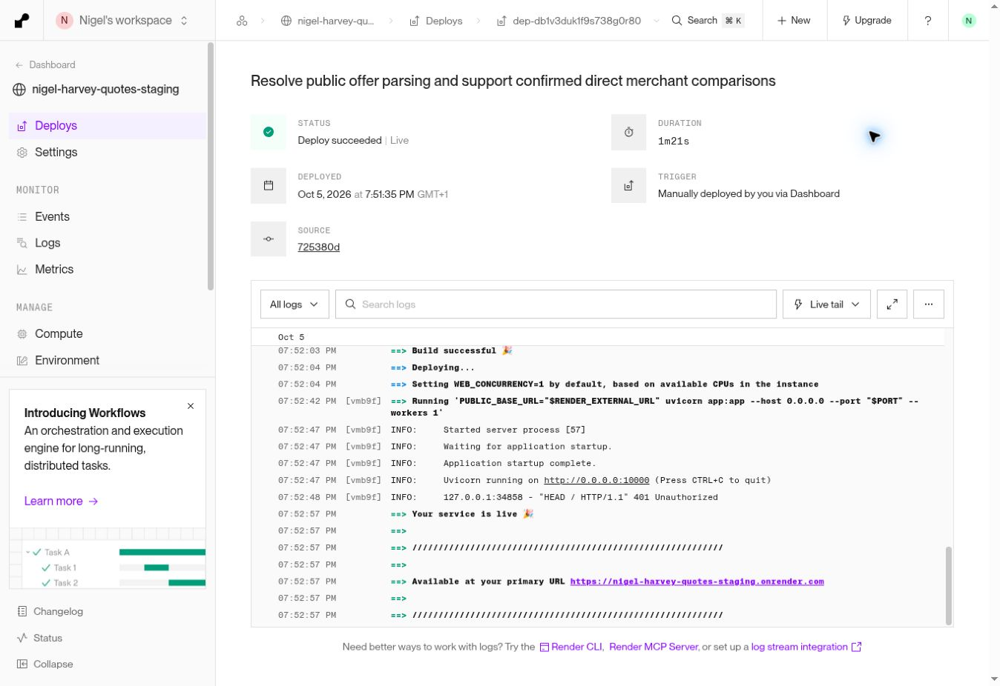

# Best Trade Price release followup — 5 October 2026

**Later UI gate:** The remaining browser blocker was resolved in a clean authenticated environment. See [the real staging UI gate](best-trade-staging-ui-gate-20261005.md), which recommends READY for Nigel's approval within the now-accepted public-price scope. The report below preserves the earlier validation state.

**Recommendation at this earlier checkpoint: NOT READY for production. PR #2 remains draft and unapproved.** The public offer/parser blockers are resolved for the tested City Plumbing and Selco pages. A genuine two-merchant comparison and its quote persistence now pass on staging. Real staging browser interaction remains blocked by the validation environment; automatic discovery is also incomplete. No production changes or merge occurred.

## Deployment, tests and restoration

- Tested executable commit: `725380dd82c518945b675e0bacb77030cec24aed`, on `feature/best-trade-price-comparison`.
- Staging service: `srv-das0vrflk1mc73dtb2cg`; manual deployment `dep-db1v3duk1f9s738g0r80`, live at **2026-10-05 18:52:56.774804 UTC**. Auto deploy remains off.
- Before deployment: staging was on the same feature branch at `3f97e1ae826bf7dcfea9132478568c01e5c0c970`, deployment `dep-db1tmqmgekts73fd4v7g`.
- New restoration checkpoint taken before changes at **18:32:47.750132 UTC**: `/var/data/backups/best-trade-followup-preflight-20261005.sqlite`, with adjacent JSON manifest. SHA-256: `4b24058bf19ac114ed44d0a30168e957d28be5bface7e1c188d49e1ece05ba8c`. Original earlier checkpoint is also preserved. Restoration would require separately choosing whether to discard the later labelled validation quote; no restoration was performed.
- **169 automated tests passed locally and in GitHub CI**, including new parser, equivalence, VAT, pack, expired offer, unavailable merchant and quote-selection tests. Complete isolated Chromium workflows passed; console errors, page errors, failed requests and failed responses were empty. [CI run](https://github.com/nigelharveyplumbing-dev/nigel-harvey-quotes/actions/runs/37358744642).
- Quote calculations, legacy live lookup, model defaults and requirements were unchanged by this followup. The existing 25% procurement/handling default and silicone allowance remain intact. No schema migration was added or run.
- Production metadata and main were verified read-only at completion: `630eefa4baa9aa3548690848ac240a74b1607c0d`, production deployment `dep-daui7j7avr4c7399uqt0`, unchanged since 30 September. Production database was not accessed.

## Merchant results

**Screwfix — live comparison unavailable.** The prior real staging request returned a CloudFront HTTP 403 request-blocked response. This does not establish the precise cause or prove bot detection. No reliable permitted application source was established. [Current website terms](https://www.screwfix.com/help/websitetermsandconditions), especially clause 4.2, distinguish internal business use from other reuse; no additional permission/feed was verified. No proxies, fingerprint changes, authenticated scraping, access-control bypasses or alternate-route evasion were attempted. The new comparison adapter makes no Screwfix requests and returns an explicit unavailable status, with zero offers and no winner. Existing legacy pricing behaviour is preserved. Historical browser prices are identified as historical below, never revived as live offers.

**City Plumbing — tested public product pages pass.** Main product SKU, manufacturer brand and Supplier Part Number are bound to the structured product and specification block. Drayton `07 05 0150` is **£23.23 each inc VAT**; Stelrad K2 `80602210` is **£101.96 each inc VAT**. The main price/postfix supplies VAT evidence; Was prices, bundles, recently viewed products, delivery thresholds, page VAT toggles and trade-login prompts are excluded. Explicit ex-VAT conversion has regression coverage but neither tested current City offer required it. These are public prices, not Nigel's account prices. Location-specific stock remains unknown.

**Selco — tested product page passes.** Chrome Compression Equal Elbow 15mm, item `344710921`, is **£3.10 ex VAT / £3.72 inc VAT**, single selling unit. Fresh product-bound main price-box evidence supplies the current offer. The page's JSON-LD offer expired in 2020 and is not treated as current price or current InStock evidence. UTF-8 decoding now follows the explicit page charset. No unrelated amount, delivery charge or checkout discount is used. No manufacturer MPN/GTIN is available, so this row cannot establish cross-merchant equivalence.

**Toolstation — all ten original product pages pass**, plus the genuine TRV comparison counterpart. Selected SKU/variant, selling pack and product price/VAT are bound together; technical Manufacturer ID is read from the main product specification, not recommended products or variants. Promotional Was prices are ignored. Server search responses for the tested queries did not supply reliable product links; City search was likewise incomplete. The app reports this honestly and accepts an optional second supported merchant product URL. Both supplied pages are fetched fresh and still require confirmed equivalence. URLs themselves never prove equivalence.

## Real-material basket

Current website observations were independently refreshed in the merchant browser on **18:59–19:04 UTC**; staging API comparisons were freshly fetched on the deployed executable. Screwfix website observations below belong to the earlier validation and were not refreshed into a live source. All prices are GBP per selling pack. **PASS means product-bound website/API/quote checks passed; it does not mean the blocked real staging UI workflow passed.** A single confirmed product never receives BEST PRICE.

| Material tested | Merchant / SKU | Website price | App price | Pack / VAT basis | Match confirmed | BEST PRICE | Quote price result | Result / discrepancy |
|---|---|---:|---:|---|---|---|---|---|
| JG Speedfit isolation valve 15mm | Toolstation 12212 | £8.05 | £8.05 | 1; inc VAT (£6.71 ex) | Yes, selected SKU | No; one offer | £8.05 persisted | PASS |
| JG Speedfit isolation valve 22mm | Toolstation 39149 | £17.35 | £17.35 | 1; inc VAT (£14.46 ex) | Yes, selected SKU | No | £17.35 persisted | PASS |
| Copper Made4Trade end-feed elbow 15mm | Toolstation 77358 | £1.35 | £1.35 | **2 pack**; inc VAT (£1.12 ex) | Yes, selected SKU/pack | No | £1.35 per pack persisted | PASS; never compared as single fitting |
| Speedfit elbow 15mm | Toolstation 23989 | £2.55 | £2.55 | 1; inc VAT (£2.12 ex) | Yes, selected SKU | No | £2.55 persisted | PASS |
| Speedfit equal tee 15mm | Toolstation 44521 | £3.80 | £3.80 | 1; inc VAT (£3.17 ex) | Yes, selected SKU | No | £3.80 persisted | PASS |
| McAlpine A10 bottle trap 1¼ inch | Toolstation 81303 | £8.95 | £8.95 | 1; inc VAT (£7.46 ex) | Yes, selected SKU | No | £8.95 persisted | PASS |
| McAlpine WM11 washing machine trap | Toolstation 90786 | £14.29 | £14.29 | 1; inc VAT (£11.91 ex) | Yes, main SKU | No | £14.29 persisted | PASS |
| Dowsil DC785+ white silicone 310ml | Toolstation 50988 | £9.99 | £9.99 | 1; inc VAT (£8.32 ex) | Yes, selected SKU | No | Full price £9.99 persisted; charged £3.00/unit | PASS; unchanged existing consumable allowance |
| Fernox F1 inhibitor 500ml | Toolstation 57090 | £15.59 | £15.59 | 1; inc VAT (£12.99 ex) | Yes, selected SKU | No | £15.59 persisted | PASS; £19.49 Was price excluded |
| Stelrad K1 600×1000 | Toolstation 75655 | £101.49 | £101.49 | 1; inc VAT (£84.57 ex) | Yes, SKU/MPN 80601110 | No | £101.49 persisted | PASS; not equivalent to K2 |
| Flomasta full-bore valve 15mm | Screwfix 46860 | Historical £3.55 inc | Unavailable | Historical single unit; unconfirmed live | No live app match | No | Not selectable / not quoted | FAIL source availability; unavailable guard PASS |
| Speedfit 15SV isolation valve 15mm five-pack | Screwfix 25911 | Historical £44.98 inc | Unavailable | Historical **5 pack**; unconfirmed live | No live app match | No | Not selectable / not quoted | FAIL source availability; not equated to Toolstation single valve |
| Drayton TRV4 angled 15mm white/chrome | City Plumbing 818209 | £23.23 | £23.23 | 1; explicitly inc VAT | Yes, Drayton + MPN 07 05 0150 | **Yes with counterpart below** | £23.23 persisted create/edit | PASS; branch stock unknown |
| Stelrad K2 600×1000 | City Plumbing 422363 | £101.96 | £101.96 | 1; explicitly inc VAT | Yes, Stelrad + MPN 80602210 | No | £101.96 persisted | PASS; branch stock unknown |
| Chrome compression elbow 15mm | Selco 344710921 | £3.72 inc / £3.10 ex | £3.72 | 1; explicit product-bound VAT pair | Yes, main SKU; no cross-merchant MPN | No | £3.72 persisted | PASS; stock unknown; expired schema excluded |
| Drayton TRV4 angled 15mm counterpart | Toolstation 55827 | £25.79 inc / £21.49 ex | £25.79 | 1; inc VAT | **Yes, Drayton + MPN 07 05 0150** | No; City cheaper by £2.56 | Winner from City selected instead | PASS pair; Toolstation says 20+ for delivery |

**Basket: 13/15 product-price/quote checks PASS; two Screwfix source-availability FAILs are explicitly unavailable, not inaccurate winners.** The additional Toolstation TRV counterpart independently establishes the positive comparison.

## Genuine BEST PRICE and quote evidence

The deployed API returned two `public_live` offers, checked at **19:00:49–19:00:50 UTC**: City £23.23 and Toolstation £25.79, both Drayton `07 05 0150`, pack 1, GBP inc VAT. Manufacturer identity was independently read on both actual merchant sites. City received `is_best_price=true`, `compared_merchants=2`; Toolstation returned `saving_vs_best=2.56`. City stock remains `unknown`; no claim of confirmed branch availability is made. Delivery/collection costs and account discounts are outside this public-price comparison.

Staging quote **6**, customer **6**, is labelled **BEST TRADE STAGING FOLLOWUP VALIDATION 20261005**, **STAGING TEST ONLY - NOT A CUSTOMER**, **DO NOT SEND**. It contains all 13 available basket offers. Creation used quantity 2 throughout, with handling settings omitted so the existing enabled 25% default applied. GET and unchanged PUT preserved every selected full price, supplier and URL. All resulting material lines have `price_source=selected_public`, `live_price_used=false`; legacy lookup did not replace a selected price. Quote total was **£763.32** on creation and unchanged edit. An explicit edit changed only the City winner quantity from 2 to 3: its line changed from **£46.46 to £69.69**, the quote total to **£792.36**, with £23.23 unit price, supplier and 25% default unchanged. This was actual staging API quote validation; visual real-staging selection remains unverified because of the browser block.

## Stock and UI limitations

**Real out-of-stock/preorder/backorder example: not achieved.** A focused search found an old Toolstation radiator category result claiming out of stock. The current category and linked Stelrad K1 600×1400 (`15506`) instead showed **£140.99, 20+ available for delivery**. No suitable current real example was found in this bounded investigation; none was manufactured. Automated tests cover OutOfStock, SoldOut, Discontinued, PreOrder and BackOrder, including expired excluded offers; these must not be described as real-world stock evidence.

**Staging UI: blocked in validation browser.** Fresh normal navigation returned `ERR_BLOCKED_BY_CLIENT` before the application loaded. The application itself returns authenticated HTTPS **200**, with the new comparison field present, and unauthenticated **401** as intended. Together with clean complete isolated Chromium workflows, this points to a client/environment boundary rather than an application-generated error. The precise blocking component is not exposed, and no safe browser/test configuration control was available to resolve it. Authentication, TLS and application security were not weakened. This prevents an honest claim that complete real-staging Chromium interactions passed.

## Staging data integrity

At **19:03:29 UTC**, read-only SQLite checks passed `integrity_check=ok` and an empty `foreign_key_check`. Complete schema equality against the checkpoint passed. Row multiset comparisons proved every original application row unchanged, including the earlier labelled validation quote. Backup SHA-256 remains unchanged. No data cleanup/deletion occurred: keeping the labelled validation record avoids incomplete cleanup of associated intelligence/customer rows.

| Table | Before | After | Change |
|---|---:|---:|---|
| app_backups | 17 | 20 | 3 normal quote create/edit backups |
| customers | 3 | 4 | 1 labelled synthetic validation customer |
| quotes | 5 | 6 | 1 labelled synthetic validation quote |
| quote_intelligence | 5 | 6 | 1 associated validation record |
| invoices | 3 | 3 | None |
| leads | 2 | 2 | None |
| appointments, jobs, invoice_photos | 0 | 0 | None |
| material_price_cache, material_price_history | 0 | 0 | None; comparison was read-only |
| sqlite_sequence | 7 rows | 7 rows | 4 expected sequence values advanced |

Full fresh responses and evidence remain on the staging disk in `/var/data/best-trade-followup-basket.json`, `best-trade-followup-pair.json`, `best-trade-followup-quote-validation.json` and `best-trade-followup-final-database-check.json` with their logs. These do not contain production data. This report supersedes the earlier report's City/Selco parser and zero-positive-pair findings; the earlier report is preserved as history.

## Remaining release gate

1. Complete real staging UI compare → Use price → create → reopen/edit in an environment that can load the authenticated staging app, with security protections intact. The current client block cannot be silently counted as a pass.
2. Confirm acceptance of the disclosed public-source scope: Screwfix unavailable and search discovery incomplete; explicit two-product URLs are required for the demonstrated pair. No broad automatic merchant coverage is claimed.
3. Real stock exclusion remains unobserved; automated coverage passes. City/Selco stock is explicitly unknown and must remain so.

**NOT READY** until the real staging UI gate is completed and the limitations above are reviewed. PR #2 must not be merged or deployed to production without Nigel's explicit approval. Wolseley, Williams, BuyTrade and authenticated account-price integrations remain Phase 2; none was added.

