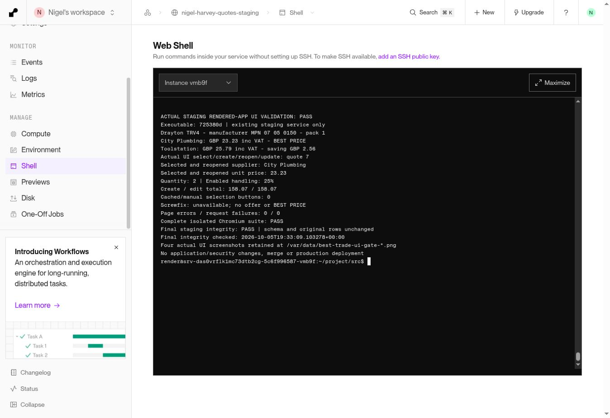

# Real staging UI release gate — 5 October 2026

**Gate: PASS. Recommendation: READY for Nigel's production approval, within the accepted public-price scope.** PR #2 remains draft, unmerged and unapproved. No production deployment or production database access occurred. No application changes were required.

## Environment and block diagnosis

The actual deployed staging executable remained `725380dd82c518945b675e0bacb77030cec24aed`, deployment `dep-db1v3duk1f9s738g0r80`, service `srv-das0vrflk1mc73dtb2cg`, at `https://nigel-harvey-quotes-staging.onrender.com`. Auto deploy remains off. There was no deployment or service configuration change during this gate.

Fresh navigation to both the staging root and `/app` in the managed validation browser failed with `net::ERR_BLOCKED_BY_CLIENT` before application JavaScript loaded. Staging protects both paths with Basic Auth. The browser authentication helper supports HTML login forms but did not expose a handler for the native HTTP Basic Auth challenge. Its extension/content-blocking internals are not exposed, so a particular extension or internal blocking component cannot honestly be identified.

The permitted alternative was a clean official Playwright 1.56.1 / Chromium 141.0.7390.37 environment running on staging, installed temporarily under `/tmp/best-trade-ui-gate`. Anonymous navigation returned the normal **401 / WWW-Authenticate: Basic**. Standard origin-scoped `httpCredentials`, reading existing credentials directly inside the process without revealing them, returned **200** and a rendered dashboard at the same HTTPS `/app` URL. The actual compare and quote requests succeeded with no page errors, failed requests or bad responses.

This isolates the blocker to the managed validation browser/environment's handling of protected navigation. It does not prove that Basic Auth itself or a named extension was defective. The application, staging URL, JavaScript and request construction worked unchanged in clean Chromium. The existing response had no CSP header; none was removed or altered. Authentication, HTTPS, certificate validation, cross-site write protections and merchant validation were unchanged. No proxy, browser fingerprint alteration, bypass-CSP or ignore-HTTPS-errors configuration was used.

## Actual rendered-app workflow

All comparison, selection, create and update operations below used normal rendered controls. No browser request interception, mocked merchant prices, direct quote creation API call or injected application state was used. Read-only API access verified the saved quote after its UI update. Incomplete merchant searches were handled by the existing optional second product URL field, with both product pages fetched fresh.

| Gate | Actual result | Outcome |
|---|---|---|
| Open material row and compare | Blank material row; name Drayton TRV4; quantity 2; City product URL and Toolstation comparison URL; actual Best Trade Price button | PASS |
| Confirm live prices | City Plumbing 818209 **£23.23 inc VAT**, checked 19:24:39 UTC; Toolstation 55827 **£25.79 inc VAT**, checked 19:24:38 UTC | PASS |
| Exact equivalence / pack | Both manufacturer **Drayton**, MPN **07 05 0150**, selling pack **1**, GBP, explicit inc VAT | PASS |
| BEST PRICE / saving | Exactly one BEST PRICE badge, on City; Toolstation displayed **£2.56 more per pack than best equivalent** | PASS |
| Select actual City result | Clicked **Use this product and price**; supplier City Plumbing, correct City URL, selected unit price **£23.23** populated | PASS |
| Quantity / handling | Quantity **2** throughout; enabled procurement/handling **25%** before selection, after selection, on reopen and on update | PASS |
| Create quote | Actual Generate Quote button, POST 200; clearly labelled synthetic staging quote **7** | PASS |
| Reopen / edit | New clean browser session; Quotes history, actual Edit button, then Update Quote button; PUT 200 | PASS |
| Price persistence | Created and edited line retains **£23.23**, City supplier and URL, `selected_comparison_price=23.23`, `price_source=selected_public`, `live_price_used=false` | PASS |
| Totals | Materials base **£46.46**; displayed handling **£11.62**; materials **£58.08**; labour **£100**; total **£158.07** on both creation and edit, using unchanged existing arithmetic/rounding | PASS |
| Cached/manual references | Real historical Toolstation £25.79 retained in one clearly labelled reference fixture; cached/manual cards had **zero selection buttons**, no BEST PRICE, unconfirmed VAT. Unsaved manual input £0.01 did not become a winner | PASS |
| Screwfix unavailable | Rendered **Screwfix: unavailable — Live comparison unavailable ... (staging HTTP 403)**; no offer, selectable result or badge | PASS |

City availability remained honestly labelled **Stock unknown**; Toolstation said in stock, branch not checked. No account-price or confirmed City branch-stock claim is made.

The £158.07 total is the existing Python calculation's final rounding of the unrounded `100 + (23.23 * 2 * 1.25)` value. Independently rounded displayed components can differ by one penny from that final total. The test initially expected £158.08; that harness expectation was corrected after inspecting the unchanged calculation. No rounding or quote-calculation change was introduced. A first harness attempt stopped before quote creation because its historical reference fixture had not been prepared. Both failed attempt records are preserved on staging; the successful gate resumed the existing quote rather than creating duplicate quotes.

## Evidence and automated checks

- [Actual UI selection and quote evidence](best-trade-staging-ui-evidence-20261005.json): fresh merchant responses, reference-button count, actual selected/reopened field values, saved create/edit material lines and totals, error diagnostics.
- [Authentication and database diagnostics](best-trade-staging-ui-diagnostics-20261005.json): 401/200 proof, HTTPS URL, Chromium version, schema and original-row checks.
- [Complete Chromium regression](best-trade-staging-ui-chromium-20261005.json): **PASS**, console errors, page errors, failed requests and failed responses all empty. Ran the existing entire browser workflow against its disposable loopback application and temporary database using the same clean Chromium installation; these isolated tests did not change staging data.
- All **169 Python/Node automated tests passed again** locally. The local combined runner initially could not start Chromium because its executable was absent there; the complete browser portion was run successfully in the clean environment above. Previous full [GitHub CI](https://github.com/nigelharveyplumbing-dev/nigel-harvey-quotes/actions/runs/37358744642) remains passed for the unchanged executable.
- Four actual rendered staging screenshots are retained on the staging persistent disk: `/var/data/best-trade-ui-gate-comparison.png`, `best-trade-ui-gate-selected.png`, `best-trade-ui-gate-reopened.png`, `best-trade-ui-gate-edited.png`. Full rendered comparison and quote text, requests and responses are retained in `/var/data/best-trade-ui-gate-result.json`. Credentials were not included. The reviewable JSON above provides equivalent browser evidence without exposing customer history.

## Staging database integrity and restoration

Before validation, a fresh checkpoint was saved at **19:18:00.003889 UTC**: `/var/data/backups/best-trade-ui-gate-preflight-20261005.sqlite`, with adjacent `.sqlite.json` manifest. SHA-256 **`b94218f035d361e1402084111d57fdbdf8b38551e0f8d46c902b5afe58e43051`** remains unchanged. Earlier checkpoints and validation records were preserved.

At **19:33:09 UTC**, after the complete browser suite, SQLite `integrity_check=ok`, `foreign_key_check=[]`, complete schema equality and row multiset preservation all passed. Every original application row remained unchanged. Normal autoincrement sequences advanced for the new records. There was no migration, deletion, cleanup or restoration.

| Table | Before | After | Change |
|---|---:|---:|---|
| customers | 4 | 5 | One labelled synthetic UI-validation customer |
| quotes | 6 | 7 | Quote 7, BEST TRADE UI GATE VALIDATION 20261005, DO NOT SEND |
| quote_intelligence | 6 | 7 | Associated normal quote record |
| app_backups | 20 | 22 | Two normal create/update backups |
| material_price_cache | 0 | 1 | STAGING UI REFERENCE ONLY; verified historical Toolstation £25.79 |
| material_price_history | 0 | 1 | Historical reference fixture record |
| invoices / leads | 3 / 2 | 3 / 2 | Unchanged |
| appointments / jobs / invoice_photos | 0 / 0 / 0 | 0 / 0 / 0 | Unchanged |

The historical fixture never supplies a live offer or winner; fresh merchant offers remain separate. No production database was accessed.

## Release recommendation

**READY for production approval for this PR's accepted public-price comparison scope.** The remaining real staging UI blocker is resolved without an application fix. Screwfix remains explicitly unavailable; automatic search can be incomplete and the second URL path remains necessary for this tested pair; no suitable genuine excluded-stock example was previously found. These accepted and documented limitations have not been relabelled as passes or removed. Wolseley, Williams, BuyTrade and authenticated trade-account integrations remain Phase 2. PR #2 stays draft and unapproved; no merge or production deployment is authorized by this recommendation.
