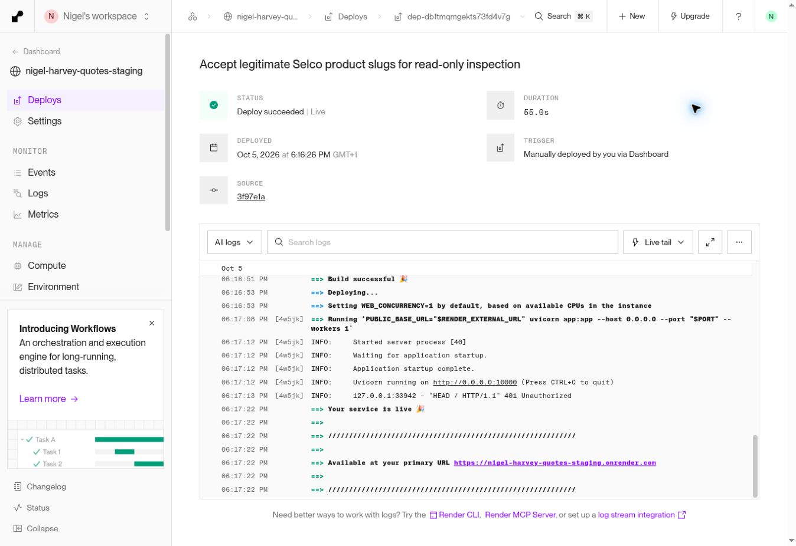

# Best Trade Price — real staging validation

5 October 2026. **Production approval: FAIL / NOT READY.** PR #2 remains draft and unmerged. No production service, production database or main-branch changes were made.

## Environment and restoration checkpoint

Only existing staging service `srv-das0vrflk1mc73dtb2cg` was changed, with the owner's explicit dashboard-fallback approval. Its separate disk is `dsk-das0vrflk1mc73dtb2t0`, mounted at `/var/data`. Auto-deploy remains off.

| State | Before | Validated staging |
| --- | --- | --- |
| Branch | `privacy/gdpr-readiness` | `feature/best-trade-price-comparison` |
| Commit | `25a3bc99388f15f7e8d5c10b8da9d0bd7438a057` | `3f97e1ae826bf7dcfea9132478568c01e5c0c970` |
| Deployment | `dep-daunp5rncjis73fl63gg` | `dep-db1tmqmgekts73fd4v7g` |
| Deployment finished | Previously live | 2026-10-05 17:17:21 UTC |

Before changing the branch, a consistent SQLite backup and baseline were recorded at 16:42:29 UTC:

- Database: `/var/data/quotes.db`, 131072 bytes, integrity `ok`.
- Restore copy: `/var/data/backups/best-trade-preflight-20261005.sqlite`.
- Restore-copy SHA256: `f6eb6663abaffd6cea300dd65f264cdce7b71d9bc6a0ca5ab6e45f9bbe399188`.
- Baseline: `/var/data/backups/best-trade-preflight-20261005.json`, including schema and per-table hashes/counts.
- Schema SHA256: `325fcbf0d7b274bd46cc2f00253cd451af5170b9caa60f385df5eca65ee775ce`.

Restoration would require changing **only staging** back to its recorded branch and deploying the recorded old commit. If reverting test data is approved, stop staging writes and restore its recorded SQLite copy using the normal controlled backup procedure. No restore was performed and no backup was removed. Restoring the whole copy would discard subsequent staging-only changes; inspect them first.

Production was read back after validation: service `srv-d72j5ocg9agc7399dni0` still tracks `main`, auto-deploy off, live deployment `dep-daui7j7avr4c7399uqt0`, commit `630eefa4baa9aa3548690848ac240a74b1607c0d`. Its database was not accessed.

## Method and limits

The actual merchant pages were inspected in the cloud browser, including selected variant, pack, current/old price, explicit VAT text and visible stock. Website observations span 16:48–17:04 UTC. The final deployed authenticated comparison endpoint was exercised from the staging service itself at 17:18:30–17:19:40 UTC. Each of the 15 queries used its actual merchant product URL as the anchor and queried the four existing merchants. All final endpoint responses were HTTP 200; an HTTP 200 comparison response is not proof of merchant coverage.

Quote checks used the real deployed staging HTTP create, retrieve and update endpoints, not a mocked quote calculation. The public staging app URL could not be opened by this browser (`net::ERR_BLOCKED_BY_CLIENT`). Consequently, actual staging button-click/form hydration and the rendered BEST PRICE badge were **not visually validated**. The full isolated Chromium workflows passed, including explicit comparison selection, request payload, editing and Update-price behaviour, but do not replace that missing staging UI check.

**PASS below means the observed single-merchant price, selected product/pack and staging API quote persistence passed. It does not mean a two-merchant comparison or all ten acceptance checks passed.** FAIL means no usable confirmed comparison offer could be validated. No cross-merchant equivalent pair was established for any basket material: all observed `is_best_price` values were false. No names, dimensions or local merchant SKUs were substituted for authoritative cross-merchant identity.

## Material results

Website/app amounts are GBP per selling pack, including VAT unless an explicit ex-VAT figure is shown. Quote figures are stored full product price / charged unit price, before quantity and the separate procurement charge. All tested quote quantities began at two **packs**.

| Material tested | Merchant / SKU | Website price and VAT | Final app price / VAT | Pack website / app | Match confirmed | BEST PRICE result | Quote create / edit result | Discrepancy / outcome |
| --- | --- | --- | --- | --- | --- | --- | --- | --- |
| JG Speedfit isolation valve 15mm | Toolstation 12212 | £8.05 inc / £6.71 ex | £8.05 inc | 1 / 1 | Yes, selected SKU; no cross-merchant pair | No, only one offer; MPN/GTIN missing | £8.05 / £8.05 held, PASS | Initial double-VAT bug fixed; **PASS (price/quote)** |
| JG Speedfit isolation valve 22mm | Toolstation 39149 | £17.35 inc / £14.46 ex | £17.35 inc | 1 / 1 | Yes, distinct 22mm SKU; no pair | No | £17.35 / £17.35 held, PASS | **PASS (price/quote)** |
| Made4Trade copper end-feed elbow 15mm, 2 pack | Toolstation 77358 | £1.35 inc / £1.12 ex for two | £1.35 inc | 2 / 2 | Yes, selected two-pack SKU; no pair | No | £1.35 / £1.35 held, PASS | Title omitted pack; pack and review-URL issues fixed; **PASS (price/quote)** |
| JG Speedfit elbow connector 15mm | Toolstation 23989 | £2.55 inc / £2.12 ex | £2.55 inc | 1 / 1 | Yes, selected SKU; no pair | No | £2.55 / £2.55 held, PASS | **PASS (price/quote)** |
| JG Speedfit equal tee 15mm | Toolstation 44521 | £3.80 inc / £3.17 ex | £3.80 inc | 1 / 1 | Yes, selected SKU; no pair | No | £3.80 / £3.80 held, PASS | **PASS (price/quote)** |
| McAlpine A10 bottle trap, 1¼ inch | Toolstation 81303 | £8.95 inc / £7.46 ex | £8.95 inc | 1 / 1 | Yes, selected SKU and size; no pair | No | £8.95 / £8.95 held, PASS | **PASS (price/quote)** |
| McAlpine WM11 washing-machine trap, 75mm seal, 1½ inch | Toolstation 90786 | £14.29 inc / £11.91 ex | £14.29 inc | 1 / 1 | Yes, main SKU and pack; no pair | No | £14.29 / £14.29 held, PASS | Single-variant page lacked selector; fixed; **PASS (price/quote)** |
| Dowsil DC785+ silicone, white 310ml | Toolstation 50988 | £9.99 inc / £8.32 ex | £9.99 inc | 1 / 1 | Yes, selected white/310ml SKU; no pair | No | £9.99 full price held; £3.00 allowance, PASS | Existing partial-tube allowance deliberately preserved; **PASS (price/quote)** |
| Fernox F1 inhibitor/protector, 500ml | Toolstation 57090 | £15.59 inc / £12.99 ex; was £19.49 | £15.59 inc | 1 / 1 | Yes, 500ml selected SKU; no pair | No | £15.59 / £15.59 held, PASS | Current sale price, not old price or 400ml variant; **PASS (price/quote)** |
| Stelrad Softline K1 radiator 600×1000, 3345 BTU | Toolstation 75655 | £101.49 inc / £84.57 ex | £101.49 inc | 1 / 1 | Yes, K1 dimensions/SKU; no pair | No | £101.49 / £101.49 held, PASS | Never equated to K2; **PASS (price/quote)** |
| Flomasta full-bore isolation valve 15mm | Screwfix 46860 | £3.55 inc, single-item tier | No offer | 1 / unconfirmed | No usable app match | No | Not selectable; not quoted | Staging merchant HTTP 403; **FAIL** |
| JG Speedfit 15SV isolation valves 15mm, 5 pack | Screwfix 25911 | £44.98 inc per five-pack | No offer | 5 / unconfirmed | No usable app match | No | Not selectable; not quoted | Staging merchant HTTP 403; single Toolstation valve not equated to five-pack; **FAIL** |
| Drayton TRV4 angled 15mm white/chrome, 07 05 0150 | City Plumbing 818209 | £23.23 inc each; was £26.03 | No final offer; first pass £23.23, VAT unknown | 1 / first pass 1 | No confirmed comparable app offer | No | Disabled first pass; unavailable final pass | First-pass VAT/MPN incomplete; final fetch/search unavailable; **FAIL** |
| Stelrad Softline K2 radiator 600×1000, 80602210 | City Plumbing 422363 | £101.96 inc each | No final offer; first pass £101.96, VAT unknown | 1 / first pass 1 | No confirmed comparable app offer | No | Disabled first pass; unavailable final pass | VAT/MPN incomplete; final fetch/search unavailable; K2 distinct from K1; **FAIL** |
| Chrome compression copper equal elbow 15mm | Selco 344710921 | £3.10 ex / £3.72 inc | Price unavailable; VAT unknown | 1 / 1 | SKU/title match yes; comparable price no | No | Not selectable; not quoted | Root slug rejection fixed (400→200); price parser still incomplete; **FAIL** |

### Merchant failures and identity coverage

- **Toolstation:** ten anchored prices/pack quantities reconciled exactly. All ten pages showed 20+ available for delivery; the API reported `in_stock`, explicitly not branch-confirmed stock. JSON-LD lacked MPN/GTIN. Search-only queries for other anchored merchants returned no candidates. Ten accurate anchors do not constitute ten multi-merchant comparisons.
- **Screwfix:** product websites were readable in the browser. Staging's request to the Flomasta product returned HTTP 403 with CloudFront's “The request could not be satisfied” / “Request blocked” message. Searches and both anchors were unavailable. Cause was not proven to be bot detection; no proxies, fingerprint changes, account borrowing or other bypasses were attempted. Local stock was not confirmed by the browser's Collect/Deliver controls.
- **City Plumbing:** browser showed public prices explicitly including VAT, manufacturer supplier part numbers and each selling unit; account pricing required login. First deployed pass fetched two anchors but left VAT and manufacturer identity unconfirmed. Final staging instance returned no City offers and marked all City searches unavailable. Other first-pass City searches were checked but returned zero candidates. Availability required a branch/postcode; no customer location was supplied or guessed.
- **Selco:** browser showed item code, both VAT amounts and collection availability. A staging direct product request returned HTTP 200. Final app now accepts its legitimate root slug and returns the correct SKU/title/pack, but no verified structured GBP offer. Its search remained unavailable. No account discount or checkout reward was included.

Cached/manual references were not present in this staging database. Regression tests prove those provenance types never win or become live selectable prices. Real basket results contained no cached/manual winners. Likewise, this basket contained no confirmed out-of-stock/preorder/backorder offer to exercise a real-world exclusion; negative contract tests pass, but that real-site scenario remains unvalidated. Positive real-site BEST PRICE behaviour is also unvalidated because no two confirmed equivalent merchant offers were available.

## Quote workflow and staging data

One synthetic quote **ID 5**, customer **ID 5**, named `BEST TRADE STAGING VALIDATION 20261005`, contains the ten usable Toolstation offers. The actual sequence was POST create → GET saved quote → PUT unchanged request → PUT explicit first-line quantity change from 2 to 3. Supplier, URL, product name, selected gross amount and `selected_public` provenance survived creation and both edits. The legacy material cache and price history stayed empty, consistent with the selected-price path not invoking the legacy lookup.

- Creation and unchanged-edit total: **£441.05** (materials base £352.84 plus £88.21 procurement, no labour/callout/travel).
- Explicit first-line quantity edit: **£451.11**; all other quantities stayed two, price stayed £8.05, supplier stayed Toolstation, handling stayed 25%.
- Silicone kept its original £3.00 partial-consumable charge; storing £9.99 as the full product price did not silently change that rule.
- No email, invoice, payment link, order or customer communication was generated.

Database integrity was checked before each deployment and after validation. Before quote creation, schema and every table's content hash were unchanged from the checkpoint. At 17:22:48 UTC, integrity was `ok`, schema unchanged, and a row-multiset comparison against the restore copy proved **no pre-existing application row was changed or removed**.

| Table | Before | After | Explanation |
| --- | ---: | ---: | --- |
| customers | 2 | 3 | One labelled synthetic customer |
| quotes | 4 | 5 | One labelled synthetic quote |
| quote_intelligence | 4 | 5 | Normal quote-creation record |
| app_backups | 14 | 17 | Normal backups before create and two edits |
| invoices | 3 | 3 | Unchanged |
| leads | 2 | 2 | Unchanged |
| material_price_cache | 0 | 0 | Unchanged |
| material_price_history | 0 | 0 | Unchanged |
| appointments / jobs / invoice_photos | 0 | 0 | Unchanged |

SQLite sequence values advanced normally for the four tables receiving inserts; sequence row count remained seven. No migration, schema change, production DB access or unrelated record update occurred. The restore-copy SHA256 still matched. Staging test rows remain deliberately labelled; they were not deleted.

Additional staging disk files are the restore copy, baseline JSON, first/final basket JSON/logs, initial diagnostic result, synthetic created-quote JSON, quote-validation JSON/log and final DB-check JSON. They are evidence/backup files, not changes to existing customer records. Raw SQLite copies and existing-customer data were not uploaded to GitHub.

## Bugs fixed and tests

1. Comparison selections previously allowed a legacy live lookup to replace the selected amount. Fixed before first staging deployment; optional selected amount persists in existing quote JSON and skips only that row's legacy lookup.
2. Toolstation gross/net adjacent layout was misread as gross excluding VAT: £8.05 became £9.66. Fixed with amount-attached VAT and SKU-bound gross/net evidence.
3. Toolstation titles omitted multi-pack count. Fixed by selected SKU selling-pack evidence, with conflicting/missing pack data failing closed.
4. Sale price layout includes a crossed-out old amount. Tested £15.59 current against £19.49 old and £12.99 net; selected current price is used.
5. Single-variant Toolstation pages omit the selector. Added a strictly bound main-content SKU/pack fallback.
6. Toolstation `bvstate` review state caused false URL mismatch. Only that merchant-specific review key is ignored; meaningful variant parameters remain distinct.
7. Legitimate Selco root product slugs were rejected by a legacy discovery URL rule. Comparison-only anchor validation now permits inspection; a slug itself never proves identity/price. Legacy merchant search is unchanged.

Full local Python/Node suite: **155 tests passed**. GitHub Actions run **37346892424**, job **111887597578**, passed all 155 tests and full Chromium workflows with no console/page errors, failed requests or failed responses. Workflow is tests-only with no deployment step. Executable commit tested/deployed: `3f97e1ae826bf7dcfea9132478568c01e5c0c970`.

CI: https://github.com/nigelharveyplumbing-dev/nigel-harvey-quotes/actions/runs/37346892424

## Remaining release requirements

**Do not approve PR #2 for production yet.** Automated safeguards pass, and ten real single-merchant price/API-quote checks pass. The requested multi-merchant feature has not passed its complete staging acceptance gate.

1. Obtain reliable permitted discovery and product-price access for Screwfix/City/Selco. Do not bypass merchant access controls. Preserve explicit failure status.
2. Complete trustworthy City VAT/manufacturer identifier extraction and Selco offer-price extraction against actual page evidence; add captured public fixtures and regression tests. Do not promote a guessed amount or VAT basis to live.
3. Obtain authoritative cross-merchant manufacturer identifiers/pack mappings and demonstrate at least two genuinely equivalent current offers in staging, including a positive BEST PRICE case and a pack mismatch negative case.
4. Complete staging UI selection, saved-quote hydration, explicit refresh and form editing when the staging URL is accessible. API and isolated browser evidence must remain clearly distinguished.
5. Exercise a genuine unavailable/preorder/out-of-stock product in staging as well as the passing synthetic exclusion tests.
6. Rerun the full suite and affected staging basket after further code changes. Owner approval is still required before any merge or production deployment.

## Phase 2 trade-account integrations

Prioritise **Wolseley's approved read-only price/stock API**. Its official developer portal describes live pricing/stock, OAuth2 client credentials and an approval/onboarding process. An owner-provided **Wolseley My prices CSV** is a useful interim account-price import; label it cached, not live (official guide says emailed within 48 hours).

Next: **City Plumbing / PTS** account-specific export or provider-approved feed, then **Williams** authorised account pricing/export. Their public account pages establish account pricing/access, not permission to scrape authenticated sessions or proof of an available third-party API. Existing Screwfix/Toolstation/Selco account-specific sources should likewise use approved exports/integrations when obtainable, with account, VAT, selling-unit, availability and verification time recorded separately.

BuyTrade and BuildCompare remain integration/licensing investigations, not enabled sources; no consumer API access was verified. No registrations, terms acceptance, external enquiries, purchases or credential changes were made.

Official sources checked:

- https://api.wolseley.co.uk/
- https://api.wolseley.co.uk/help-and-support
- https://api.wolseley.co.uk/files/next-steps-onboarding.pdf
- https://www.wolseley.co.uk/wcsstore/Wolseley/Attachment/how-to-guides-main/30-My-prices.pdf
- https://www.cityplumbing.co.uk/content/pts
- https://www.tradeonlyplumbing.co.uk/register-existing-customer

## Verified merchant pages

These URLs were actually opened; figures above are page observations, not search-snippet prices.

1. https://www.toolstation.com/jg-speedfit-isolating-valve/p12212
2. https://www.toolstation.com/jg-speedfit-isolating-valve/p39149
3. https://www.toolstation.com/made4trade-end-feed-elbow/p77358?bvstate=pg:3%2Fct:r
4. https://www.toolstation.com/jg-speedfit-elbow-connector/p23989
5. https://www.toolstation.com/jg-speedfit-equal-tee/p44521
6. https://www.toolstation.com/mcalpine-bottle-trap/p81303
7. https://www.toolstation.com/mcalpine-wm11-washing-machine-trap/p90786
8. https://www.toolstation.com/dowsil-dc785-sanitary-silicone-sealant/p50988
9. https://www.toolstation.com/fernox-f1-central-heating-inhibitor-protector/p57090
10. https://www.toolstation.com/stelrad-softline-compact-type-k1-steel-panel-radiator/p75655
11. https://www.screwfix.com/p/flomasta-full-bore-isolating-valve-15mm/46860
12. https://www.screwfix.com/p/jg-speedfit-15sv-isolating-valves-15mm-5-pack/25911
13. https://www.cityplumbing.co.uk/p/drayton-trv4-15mm-angled-trv-whitechrome-07-05-0150/p/818209
14. https://www.cityplumbing.co.uk/p/stelrad-softline-compact-k2-double-panel-radiator-600mm-x-1000mm-80602210/p/422363
15. https://www.selcobw.com/chrome-compression-equal-elbow-15mm

